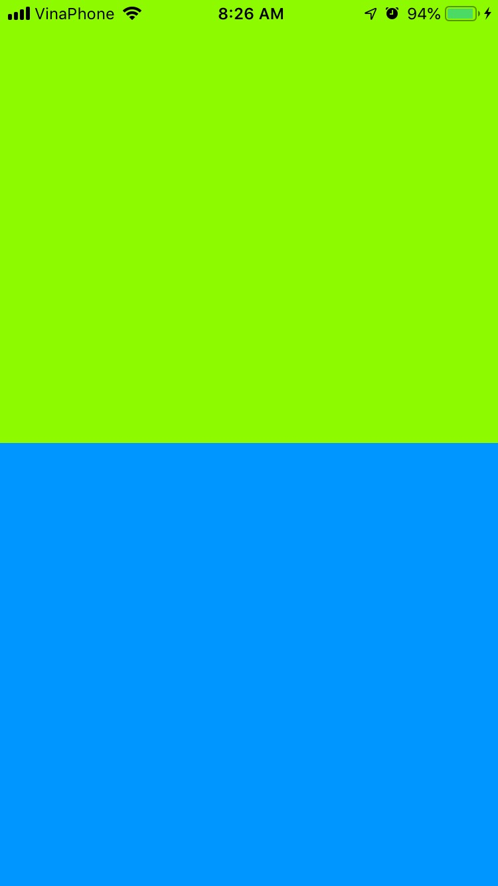

# learn-ios-divide-exact-half
## How to format 2 elements fit each into exact 1/2 of iOS device (iPhone, iPad...)

See how it look like:
## iPhone
### Portrait

### Landscape

## iPad Pro
### Portrait

### Landscape

## How to
- Add 2 Views: namely GreenView + BlueView
- Control + drag GreenView to its parent in Document Outline
- Add constraint : Equal Height
- Then edit Proportional Height "multiply: 1:2" in Size Inspector
- Set Left + Top + Right constraint to 0

Next
- Control + drag BlueView to GreenView in Storyboard
- Add constraint: Equal Height
- set Left + Bottom + Right constraint to 0

Done
